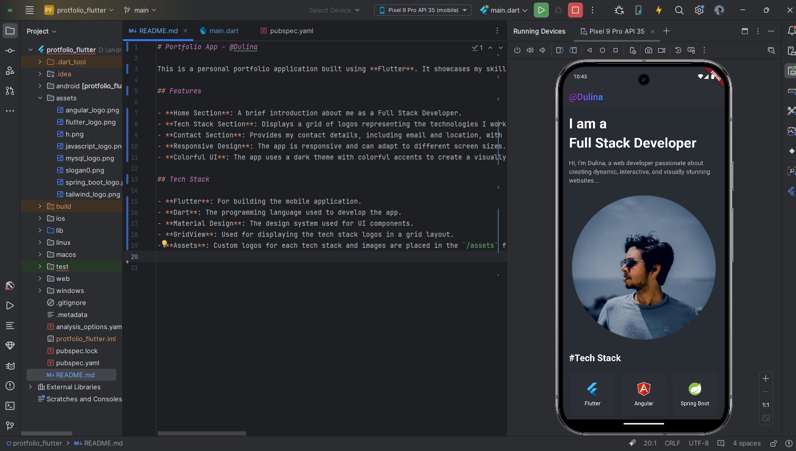

# Portfolio App - @Dulina

This is a personal portfolio application built using **Flutter**. It showcases my skills as a full-stack developer, with a section for my tech stack, contact information, and a brief introduction. The app features a clean and modern design, providing a great way to showcase my work and skills to potential clients or employers.

## Features

- **Home Section**: A brief introduction about me as a Full Stack Developer.
- **Tech Stack Section**: Displays a grid of logos representing the technologies I work with (Flutter, Angular, Spring Boot, MySQL, Tailwind CSS, JavaScript).
- **Contact Section**: Provides my contact details, including email and location, with clickable icons to my GitHub and LinkedIn profiles.
- **Responsive Design**: The app is responsive and can adapt to different screen sizes.
- **Colorful UI**: The app uses a dark theme with colorful accents to create a visually appealing user experience.

## Tech Stack

- **Flutter**: For building the mobile application.
- **Dart**: The programming language used to develop the app.
- **Material Design**: The design system used for UI components.
- **GridView**: Used for displaying the tech stack logos in a grid layout.
- **Assets**: Custom logos for each tech stack and images are placed in the `/assets` folder.

