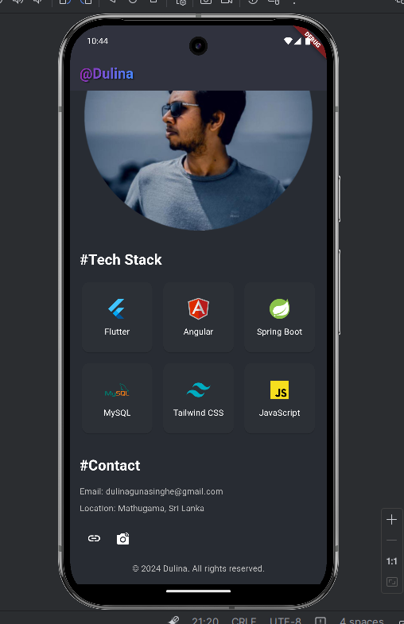

# Portfolio App - @Dulina

This is a personal portfolio application built using **Flutter**. It showcases my skills as a full-stack developer, with a section for my tech stack, contact information, and a brief introduction. The app features a clean and modern design, providing a great way to showcase my work and skills to potential clients or employers.

## Tech Stack

- **Flutter**: For building the mobile application.
- **Dart**: The programming language used to develop the app.
- **Material Design**: The design system used for UI components.
- **GridView**: Used for displaying the tech stack logos in a grid layout.
- **Assets**: Custom logos for each tech stack and images are placed in the `/assets` folder.

